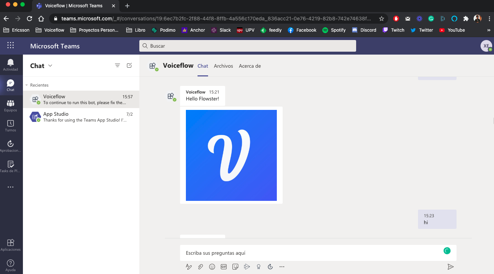

<!-- TOC -->

- [Microsoft Teams Voiceflow Bot](#microsoft-teams-voiceflow-bot)
  - [Prerequisites](#prerequisites)
  - [Overview](#overview)
  - [Microsoft Teams - App Configuration](#microsoft-teams---app-configuration)
    - [Creating App Manifest with App Studio](#creating-app-manifest-with-app-studio)
      - [App Details](#app-details)
      - [Bots config](#bots-config)
        - [App Credentials](#app-credentials)
      - [Finish creating the app manifest package](#finish-creating-the-app-manifest-package)
  - [Voiceflow Configuration](#voiceflow-configuration)
  - [Test your bot](#test-your-bot)
  - [Deployment](#deployment)
  - [Resources](#resources)
  - [Conclusion](#conclusion)

<!-- /TOC -->

# Microsoft Teams Voiceflow Bot
This is a Microsoft Teams Bot using Bot Builder.

Microsoft Teams is one of the most important applications used in business. It has a lot of funcionalities like Channels, Apps and chatbots. In this example, we are going to build a MS Teams bot using [Bot Builder](https://www.npmjs.com/package/botbuilder) and the [Voiceflow runtime Client SDK](https://github.com/voiceflow/runtime-client-js).



## Prerequisites

Here you have the technologies used in this project
1. Voiceflow Account
2. VS Code
3. Microsoft 365 developer account ([Sign up if you don't have one already!](https://developer.microsoft.com/en-us/microsoft-365/dev-program))
4. App Studio - look for the app in Teams desktop client and install
## Overview

Bots are conversational apps that a user can send and/or receive messages to/from the bot.

1. **index.ts:** The TypeScript code that listens to the incoming requests. Using Bot Builder and Express.JS
2. **bot.ts:** Sends a message to Voiceflow using Runtime Client SDK.
3. **teams-app:** Manifest package to be installed in Teams client.

See the instruction below to see how you can create your chatbot package using **App Studio**

## Microsoft Teams - App Configuration

Here's the step-by-step how to set up the chatbot and install it on Teams.

### Creating App Manifest with App Studio

#### App Details

Open **App Studio** app in Teams client.

Then, click **Create a new app** and fill out all the required fields including the Bot names, descriptions, etc.

Generate an App ID.


In **App URLs** section, include your privacy and TOU webpages. In this example, I am just using the placeholder URL, `https://example.com`.

#### Bots config

From the left menu, select Capabilities > **Bots**.

Then click **Set up** to configure a new bot. Fill out the bot name, and let's just select the Personal scope for now.

Then, click **Generate new password**. At the prompt, copy the password, which you will need to paste it in your **.env** file at the next step!

##### App Credentials

Copy the ID under your bot name (something looks like `123xx567-123x-...`) and paste it as an environment variable in your `.env` file.

Under **App Passwords**, generate a new password, and copy it. Then paste it in your `.env` file.

These credentials are used to initialize your bot adapter. (See index.ts).

For **Messagind Endpoint**, we will use [ngrok](https://ngrok.com/). The URL should be something like: `https://<id>.ngrok.io/api/messages`.

#### Finish creating the app manifest package

Go to Finish > **Test and distribute**.


If you get any errors, go fix it, otherwise, click **Install** your client.

You can also download the zip file that contains `manifest.json`, and two icon images to install later or distribute.

## Voiceflow Configuration

**NOTE:** Before continue, it is important to note that you should have a General Project created on Voiceflow.

Let's create the Voiceflow client to work with Voiceflow's cloud using its Runtime Client SDK:
```js
const getClient = async (ctx: Context) => {
  const senderID = ctx.message.from.id.toString();
  const state = await kvstore.get(senderID);
  return factory.createClient(state);
};
```

The `getclient()` function calls the `createClient` method of the factory object. This is the intialization of that factory object:
```typescript
const factory = new RuntimeClientFactory({
  versionID: process.env.VOICEFLOW_VERSION_ID, // voiceflow project versionID
  apiKey: process.env.VOICEFLOW_API_KEY!, // voiceflow api key
  endpoint: process.env.VOICEFLOW_RUNTIME_ENDPOINT,
});
```

As you can see there are some values that will be added to our `.env` file. Let's explain how to obtain those variables.

1. **VersionID**

To obtain your VersionID you have to go to your Voiceflow Project:


Then copy the `VERSION_ID` from the URL in your address bar. When you are inside a Voiceflow project, your address bar should have a URL of the form: `https://creator.voiceflow.com/project/{VERSION_ID}/...`

2. **apiKey**
   
To obtain the API Key we have to go to our workspace where we have created our General Project. After this, we have to append to the URL `/api-keys`:


Then we have to click to `Create new API Key` button to create a new one:


There you have to add a name to the new API Key, for example, `ms-teams-bot`. Once we have filled it, we can click the `Confirm` button:


Finally, we have to add these variables to our final `.env` file. It should look like this:

```properties
MicrosoftAppId=<your-app-id>
MicrosoftAppPassword=<your-app-password>
VOICEFLOW_VERSION_ID='<your-version-id>'
VOICEFLOW_API_KEY='<your-api-key>'
VOICEFLOW_RUNTIME_ENDPOINT='https://general-runtime.voiceflow.com'
```

## Test your bot

In your Teams client, let's try out the personal bot. You can access the bot you just installed from the sidebar at your left.

Now you have the 1:1 chat interface with the bot. Let's type sending a message.


## Deployment

Ngrock is a great tool, however, this does not work for production environments.

To deploy your chatbot, you can take a look at [Deploy your bot to Azure](https://docs.microsoft.com/en-us/azure/bot-service/bot-builder-tutorial-basic-deploy).


## Resources
* [Official Bot Builder Documentation](https://www.npmjs.com/package/botbuilder) - The Official Bot Builder Documentation
* [Official Voiceflow's Runtime Client SDK Documentation](https://github.com/voiceflow/runtime-client-js) - Official Voiceflow's Runtime Client SDK Documentation

## Conclusion 

As you can see with just 60 lines of code we have a Telegram bot connected to Voiceflow.

I hope this example project is useful to you.

That's all folks!

Happy coding!